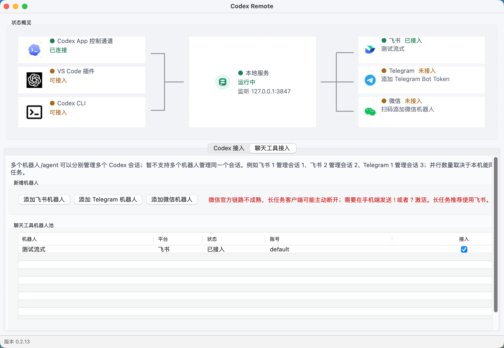
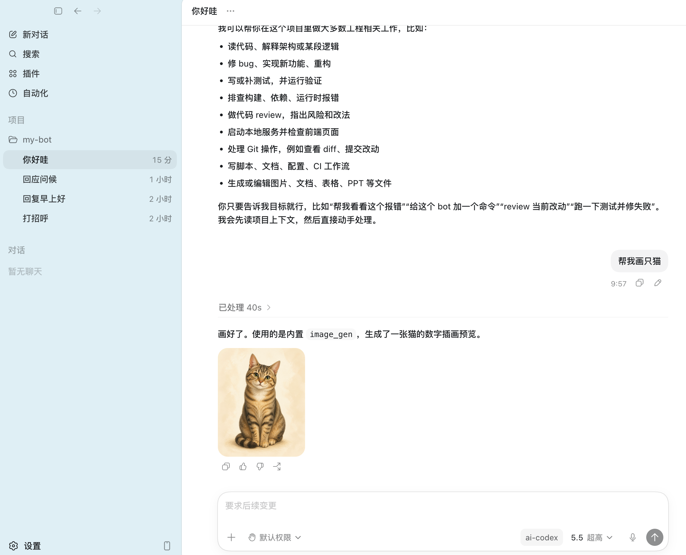
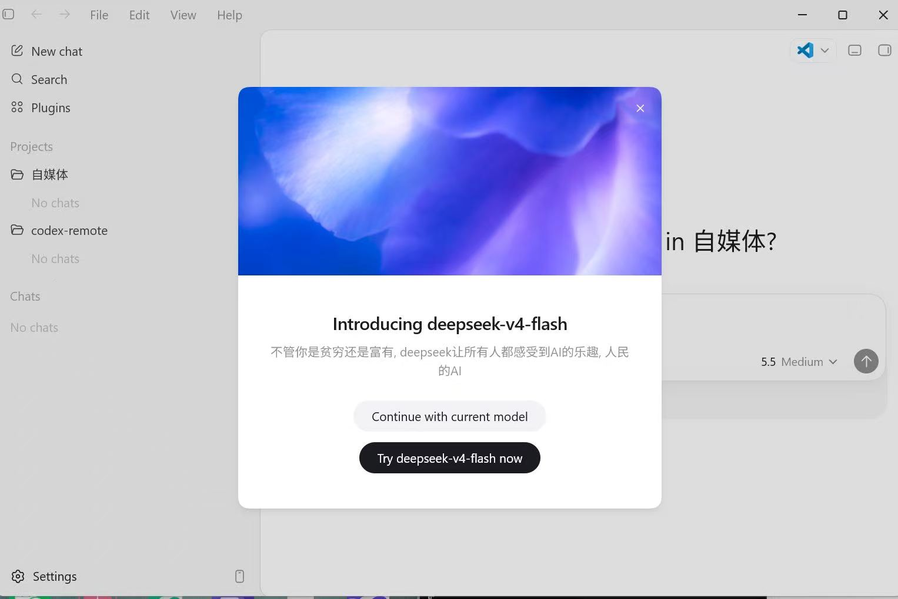
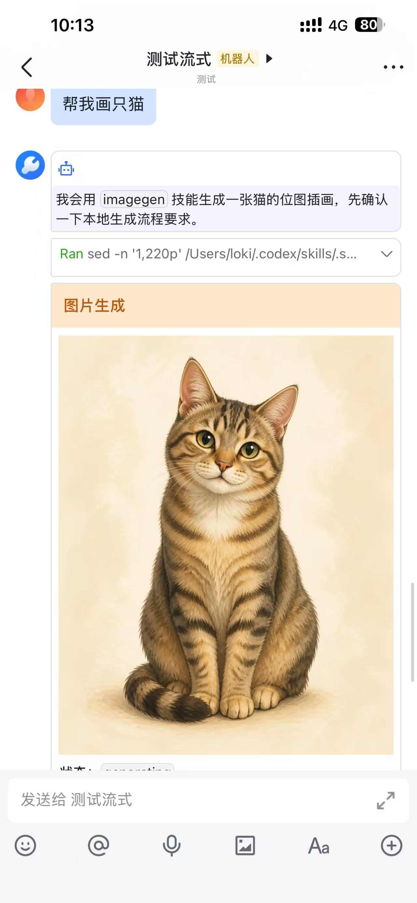
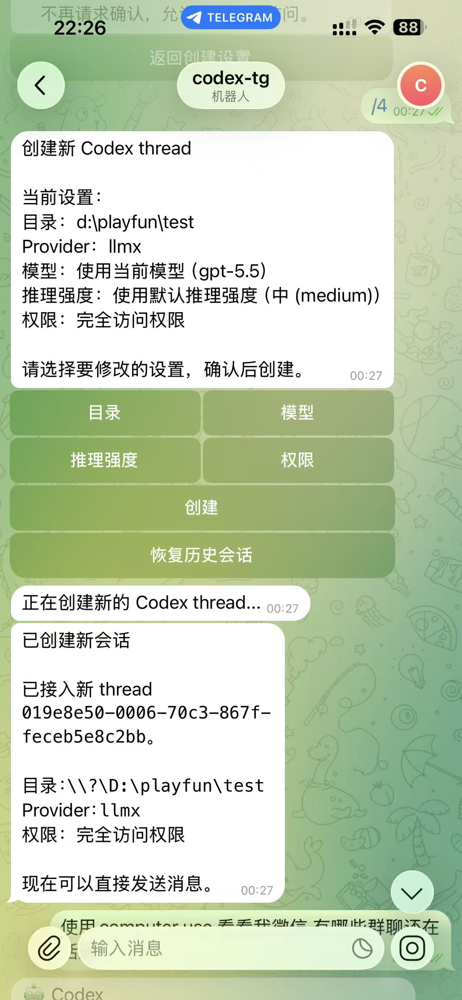
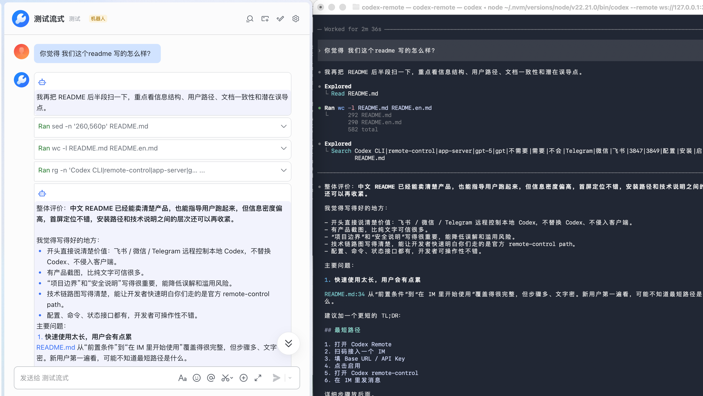

# chatroute

[English](README.en.md)

## 项目说明

ChatRoute 基于开源项目 [happy-loki/chatroute](https://github.com/happy-loki/chatroute) 按个人实际使用需求进行改进和维护。感谢原项目及其贡献者。

本项目仅供个人学习、测试和日常使用，不提供商业服务，也无商业化意向。请使用者自行确认其使用场景、所接入模型服务及相关数据处理符合适用的法律、服务条款和组织规范。

## 产品预览

| 功能 | 说明 |
| --- | --- |
| 远程和本地同屏操作 | 支持飞书、微信、Telegram 远程连接本地 Codex App、Codex VS Code 插件和 Codex CLI，同一个 Codex 会话可以在 IM 和本地客户端之间同步操作。 |
| 本地 Codex 接入 | 不修改任何 Codex 前端代码，通过本地 backend 连接 Codex App、VS Code 插件和 Codex CLI。 |
| Codex 会话管理 | 在 GUI 中管理 Codex 历史会话；切换 provider 或接入 AI Gateway 后，可以把旧会话移动到当前入口，让 Codex App 左侧继续看到。 |
| 支持 IM 端管理 Codex 会话 | 利用 Codex 原生 remote-control 协议，在 IM 里创建会话、恢复会话、处理审批。 |
| 内置 AI Gateway | 让 Codex App 继续使用原生 Responses 入口，同时可以在本地 GUI 中接入 OpenAI、DeepSeek、Anthropic/Claude、智谱 Anthropic（API / Coding Plan）等模型渠道。 |

<p align="center">
  
</p>
<p align="center">
  
</p>
<p align="center">
  
</p>

AI Gateway 是 `chatroute` 内置的本地模型入口。Codex App 仍然按它熟悉的方式发送请求，`chatroute` 在本地把请求转到你配置的模型渠道，并把返回结果整理回 Codex 能消费的格式。渠道、模型列表、模型映射、请求日志和生图工具过滤都可以在 GUI 里完成。

<p align="center">
  
  
</p>
<p align="center">
  
</p>


## 快速使用

Codex App 和 VS Code 插件通常只需要：下载程序 -> 配置 AI Gateway -> 写入 Codex 配置 -> 重启 Codex。只有需要飞书、微信、Telegram 远程控制时，才需要接入 IM。Codex CLI 需要按第 7 步单独启动 app-server。

### 0. 前置条件

- macOS、Windows 或 Linux 设备
- Codex App、Codex VS Code 插件或 Codex CLI
- 不需要 ChatGPT 账号，也不需要“加速网络”
- 至少一个模型服务 API Key：OpenAI Responses、DeepSeek、Anthropic/Claude、智谱 Anthropic（API / Coding Plan）或其它兼容渠道
- 可选 IM 通道：只有需要飞书、微信、Telegram 远程控制时才需要

### 1. 安装

从 GitHub Releases 下载 `ChatRoute.dmg`，拖到 Applications 后打开。Linux 下载 `ChatRoute Linux x86_64.AppImage` 后赋予执行权限即可双击运行。

第一次打开时，如果 macOS 提示来自互联网，按系统提示确认即可。Windows 直接运行 release 包里的 `chatroute.exe`。Linux 如果桌面环境没有自动赋权，可以先执行 `chmod +x "ChatRoute Linux x86_64.AppImage"`。这个 App 不会安装开机启动项，也不会自动常驻后台。

后续可以在菜单 `Help -> Check for Updates` 手动检查 GitHub Releases 是否有新版本。当前 MVP 只引导打开下载页，不会静默替换本机程序。

### 2. 打开应用

打开 `ChatRoute`。GUI 会自动启动本地 backend，并在退出时关闭本次启动的 backend。

状态概览显示本地服务运行后继续下一步。

### 3. 接入 IM 通道（可选，远程控制时需要）

切到“聊天工具接入”页面，选择一个通道：

- 飞书：点击“扫码使用新机器人”，按二维码流程完成接入。
- Telegram：填写 BotFather 提供的 Bot Token，点击“保存并接入”。当前支持私聊文本、图片/文件输入、原位菜单与审批状态更新、同一 turn 的命令和子代理协作进度聚合，以及 Agent 回复草稿流式展示；群聊不会接入。
- 微信：点击“扫码连接微信”，使用微信扫码确认。
- 企业微信：点击“添加企业微信机器人”，使用企业微信扫码确认。支持私聊/群聊文本、流式与最终回复、图片文件、初始/历史会话选择卡片和审批模板卡片。

接入成功后，状态概览里的“IM 通道”会显示可用。之后正常使用不需要反复扫码或重新填 token；只有更换机器人时才需要重新接入。

### 4. 配置 AI Gateway

切到 “Codex 接入” 页面，在 AI Gateway 区域添加模型渠道。GUI 会提供常用服务商模板，也可以手工填写：

- 渠道名称
- 服务商类型
- 第三方 Base URL
- API Key
- 模型列表

如果上游模型名和你希望在 Codex 里看到的名字不一致，可以在“编辑模型映射”里把一个上游模型映射成一个或多个 Codex 可见模型。例如上游要求 `GLM-5.3`，Codex 里可以显示成 `glm-5.3`。

如果渠道不支持 Codex 请求里的生图工具，勾选“过滤生图工具”即可实时移除 `image_generation` 工具，不需要再改 Codex 配置。

### 5. 写入 Codex 配置

在 “Codex 接入” 页面点击“写入 Codex 配置”。这一步会让 Codex App 和 Codex VS Code 插件连接到本机 `chatroute`，并把模型请求交给本地 AI Gateway。

写入后如果想回到原来的 Codex 连接方式，点击“恢复 Codex 原有配置”即可。GUI 只在已经写入过配置时显示恢复入口，避免第一次使用时误操作。

### 6. 打开 Codex

正常启动 Codex App 或 Codex VS Code 插件，并打开 remote-control / 控制这台电脑。

连接成功后，`ChatRoute` 里会看到 Codex 控制通道变为已连接。

不需要在 Codex App 的“连接”设置页里看到远程连接设备列表。这个项目走的是本地 backend + IM bridge，只要 `ChatRoute` 的状态概览都正常，就可以直接在已接入的 IM 里使用。

如果 Codex App、Codex VS Code 插件和 Codex CLI 同时连接到 `ChatRoute`，IM 端新建或恢复会话时会按固定优先级选择执行端：Codex App > Codex VS Code 插件 > Codex CLI。会话绑定后，后续消息会继续发给当时选中的执行端，直到该 IM 会话退出或重新绑定。

### 7. 使用 Codex CLI

如果希望 Codex CLI 和飞书 / Telegram / 微信交互，不需要替换 `codex` 命令，也不需要安装包装脚本。macOS、Windows 和 Linux 都按下面三步操作。

1. 打开 `ChatRoute` 桌面程序，完成 IM 通道和 Codex 接入，并保持程序运行。

2. 在要操作的项目目录打开终端，启动 Codex app-server：

```bash
codex app-server --listen ws://127.0.0.1:3849 --remote-control
```

3. 再在同一个项目目录打开一个终端，连接本地 Codex TUI：

```bash
codex --remote ws://127.0.0.1:3849
```

完成后可以在 IM 里给机器人发消息，也可以在本地 Codex TUI 里继续使用同一个 Codex app-server。端口 `3849` 被占用时可以换成其它本机端口，但第 2 步和第 3 步里的地址必须一致。

### 8. 在 IM 里开始使用

在飞书、Telegram 私聊、微信或企业微信里给机器人发消息。

如果当前 IM 会话还没有绑定 Codex thread，机器人会先让你选择新建 thread 或恢复已有 thread。选择后，后续对话就会进入对应的 Codex thread。

微信链路依赖客户端下发的 context token。长任务或手机端长时间不活动时，微信客户端可能让 token 过期，导致本地 backend 暂时无法继续发送消息。遇到这种情况，在微信里发送 `!` 或 `?` 可以刷新 token；这两个激活消息只用于恢复发送链路，不会转发给 Codex。

## 网络与代理

ChatRoute 的“网络”菜单提供三种出站模式：跟随系统代理、强制直连、自定义 HTTP/SOCKS5 代理。该设置只影响 ChatRoute 访问模型服务、微信、Telegram、飞书 HTTP API 和更新地址，不会修改 macOS `launchctl`、Windows 用户环境变量或其它应用的网络设置。

使用 Clash、V2Ray 等本地代理时，可以选择“自定义 HTTP/SOCKS5 代理”，填写 `http://127.0.0.1:7890` 或 `socks5://127.0.0.1:1080`。daemon 正在运行时设置会立即生效。本地 GUI、Codex App、VS Code 与 ChatRoute 之间的回环通信不会使用这个出站代理。

TUN / Network Extension 类型的 VPN 工作在 HTTP 代理层以下。如果它拦截回环流量，仍需要在 VPN 软件中排除 `localhost`、`127.0.0.1` 和 `::1`。

## AI Gateway

AI Gateway 解决的是“Codex 只认原生模型入口，但用户想用更多模型渠道”的问题。你在 GUI 里配置渠道后，Codex App 看到的仍然是普通模型列表；真正的上游请求由 `chatroute` 负责转发和转换。

当前重点能力：

- OpenAI Responses 渠道：适合原生 Responses 或兼容 Responses 的模型服务。
- DeepSeek Responses 渠道：原生对接 DeepSeek `/v1/responses`，支持官方 hosted web search、function 和 `apply_patch`。
- DeepSeek Chat / Chat Completions 渠道：保留旧接入方式，把 Codex 请求转换成 Chat Completions，再把返回结果转换回 Codex 可消费的格式。
- Anthropic Messages 渠道：用于 Claude / Anthropic 兼容模型，支持文本、图片、工具调用、思考输出和 web search 的协议转换。
- 智谱 Anthropic 渠道：普通智谱 API 与 Coding Plan 统一走 Anthropic Messages；模型列表使用 API Key 从智谱独立目录自动获取，并处理 GLM web search 的返回差异。
- 模型映射：解决上游模型名大小写、别名、第三方转发命名不一致的问题。
- Codex 可见模型：控制 Codex App 模型列表里展示哪些模型。
- 请求日志：记录 Codex 原始请求、发给上游的请求、返回结果、错误、token、缓存、耗时和请求包大小，方便排查首帧慢、超时和协议转换问题。
- 过滤生图工具：默认关闭；打开后 AI Gateway 会从请求中移除 Codex 的 `image_generation` 工具，适合不支持生图工具的渠道。

这些能力都在 GUI 中操作，不需要用户手写配置文件。

## 交流与支持

有问题可以提 GitHub issue，也可以关注公众号后直接发消息给我。


## IM 命令  一个/q 命令就够了. 其它按照提示操作

```text
/q         中断并清除当前绑定
```

审批卡片在选择后会高亮并标记为已处理，避免聊天里堆了很多卡片后分不清哪些已经操作过。

## 恢复 Codex 原有配置

GUI 里点击“恢复 Codex 原有配置”即可恢复写入前的 Codex 连接方式。恢复后，Codex App 不再通过本地 AI Gateway 发模型请求。

这一步不会卸载 Codex，也不会删除 Codex 的会话历史。

## 项目边界

`chatroute` 只支持干净的 Codex remote-control 路径。

它不会：

- 安装 `codex` 包装命令
- 替换 Codex CLI
- 通过 shim 启动 Codex App
- 安装登录项或开机启动项
- 自动常驻后台
- 替换 Codex App、Codex CLI 或 VS Code 插件的原始可执行文件

本地 backend 只会在用户明确打开 GUI 或主动从开发工具启动时运行。

## 技术说明

主链路：

```text
Codex App / Codex VS Code 插件 / Codex CLI app-server
  |
  | chatgpt_base_url = "http://127.0.0.1:3847/backend-api"
  | 用户打开 remote-control，或启动 codex app-server --remote-control
  v
官方 Codex app-server
  |
  | outbound remote-control websocket
  v
chatroute 本地 backend
  |
  | 飞书 websocket 事件 / 消息卡片 API
  | Telegram long polling / Bot API
  | 微信 iLink long polling / sendmessage
  | 企业微信 AI Bot WebSocket / aibot_send_msg
  v
IM 通道
```

本项目实现官方 remote-control endpoint：

```text
POST /backend-api/wham/remote/control/server/enroll
GET  /backend-api/wham/remote/control/server
```

Codex remote-control 要求 ChatGPT 兼容的 auth mode。这个项目采用本地 `ChatgptAuthTokens` 形态，用来通过 Codex 客户端的 remote-control 账号检查。API-key-only auth 不能启动 remote-control。

Thread 绑定模型：

- Codex app-server 仍然维护 thread 生命周期和历史
- 一个 IM 会话同一时间只绑定一个 Codex thread
- 如果 IM 会话还没绑定 thread，bridge 会先给出新建或恢复 thread 的入口
- 从 IM 恢复某个 thread 后，会订阅这个 thread 后续的 remote-control 事件
- IM 发起的 turn 会按 turn id 记录来源，避免 userMessage 回显

## 开发

```powershell
cargo fmt
cargo test
cargo build --release --features gui --bin chatroute
```

daemon 运行时常用状态接口：

```text
GET http://127.0.0.1:3847/api/status
GET http://127.0.0.1:3847/api/remote-control/status
GET http://127.0.0.1:3847/api/remote-control/backend-status
GET http://127.0.0.1:3847/api/events
```

## 安全说明

- daemon 默认只绑定 `127.0.0.1`，不要直接暴露到公网
- 本地保存的 IM token、模型 API Key 和 Codex 认证信息都是 secret，不要提交
- 飞书和 Telegram 附件会分别下载到本地状态目录旁边的 `.im/attachments/feishu/` 与 `.im/attachments/telegram/`
- 真正使用时建议配置 `allowedOpenIds` 和 / 或 `allowedChatIds`
- bridge 可以替 IM 用户向 Codex 提交审批决定，所以飞书 / Telegram / 微信 / 企业微信访问权限应视为等价于本地 Codex 审批权限

## 更多文档

- [架构](docs/architecture.md)
- [微信集成计划](docs/wechat-integration-plan.zh-CN.md)
- [认证说明](docs/auth-notes.zh-CN.md)
- [排障](docs/troubleshooting.md)

## License

Apache-2.0
