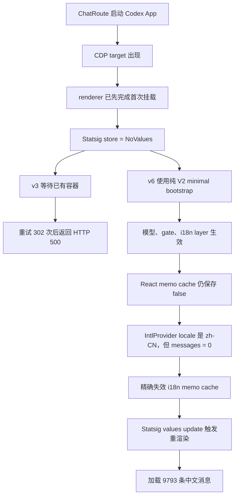

# Codex App 增强启动语言问题复盘

> 日期：2026-07-19
>
> 状态：已解决
>
> 影响范围：Codex App `26.715.4045`，ChatRoute 增强模式启动功能
>
> 复盘时增强脚本版本：`SCRIPT_VERSION = 6`；当前增强脚本已升级为 `SCRIPT_VERSION = 12`

## 1. 为什么要单独写这份复盘

从用户视角看，这个问题只是：

> Codex App 已经选择中文，普通启动可以切换语言，但通过 ChatRoute 增强启动后仍显示英文。

实际排查却跨越了五层状态：

1. Codex App 本地设置中的 `localeOverride`。
2. Statsig i18n layer `72216192` 中的 `enable_i18n`。
3. Statsig bootstrap 的 V1/V2 wire format。
4. CDP 脚本接入与 renderer 首次挂载之间的冷启动时序。
5. React Compiler memo cache 与异步语言包加载。

这五层可以分别成功或失败。模型列表正常、`localeOverride=zh-CN`、Statsig 最终显示
`enable_i18n=true`，都不等于中文语言包已经真正加载。因此排查过程中多次出现“底层指标看起来正确，
界面仍然错误”的假阳性。

本文重点记录走过的弯路、每个误判为什么当时看起来合理，以及以后如何快速定位同类问题。
协议构造和 gate 清单仍以
[Codex App 快速启动与 Statsig 兼容说明](codex-app-fast-startup-statsig.zh-CN.md) 为准。

## 2. 最终根因

最终确认有两个连续发生、彼此独立的根因。

### 2.1 冷启动时 Statsig 是 `NoValues`

ChatRoute 必须先启动 Codex App，等 CDP target 出现后才能注入脚本。真实冷启动中，renderer 在脚本
接入前已经完成首次挂载，并且错过了可拦截的 bootstrap 时机。此时运行态为：

```text
storeSource = NoValues
responseFormat = null
feature_gates = missing
dynamic_configs = missing
layer_configs = missing
```

为避免再次混写 V1/V2，增强脚本 v3 曾要求这三个容器全部存在后才写入。这个保护条件在已有缓存的
热页面上成立，在真实冷启动的 `NoValues` 页面上永远不成立。旧启动器只等待 15 秒就关闭 CDP 会话，
所以即使 Codex 随后完成官方 Statsig 初始化，增强脚本也可能失去当前 renderer 的生命周期保障。

截图中的错误：

```text
Codex App 已启动，但自定义模型列表未能生效
```

只是这个超时的表象，不是模型接口、语言设置或 Codex App 崩溃。

### 2.1.1 冷启动时 renderer 可能被替换

冷启动期间 `app://` 页面可能先出现一个 CDP target，随后由 Codex 自己重建 renderer。旧实现只对首次
target 注入一次；target ID 或 WebSocket 改变后，新的 renderer 没有增强脚本，因此日志会出现
`target_ready`、`script_installed`，但没有 `injection_applied`。

当前启动器把“发现 target、安装脚本、检查 Statsig、保留 CDP 会话”作为一个整体：最多等待 45 秒；
发现 target 更换就重新连接并安装；同一 renderer 只在脚本自身约 24 秒的重试窗口结束后再执行一次脚本。
整个过程不调用 `Page.reload`，也不注册持久后台轮询。增强状态真正满足模型、语言和关键 gate 条件后，
才把最终 CDP 会话交给保持任务。

当时的临时处理是使用 `minimalBootstrapValues()` 构造纯 V2 容器，再通过 Statsig 自己的
`setValues` 提交。这个方案虽然能让模型和中文尽快出现，却会丢掉官方 runtime、插件和浏览器配置，
因此不再作为增强模式的初始化路径。当前实现改为：有完整官方 evaluation 就以它为底座做局部
overlay；没有完整缓存就回到官方 `initializeAsync()`，官方结果进入 store 后再修补模型、i18n 和
必要 gate。诊断日志中的 `fast_initialize_source=official-network` 表示走了这个保守路径。

### 2.2 React 已缓存首次的 `enable_i18n=false`

修复 `NoValues` 后，运行态已经变成：

```text
models = 12
use_hidden_models = false
enable_i18n = true
localeOverride = zh-CN
```

但界面仍然是英文。继续检查 React Fiber 后发现：

```text
IntlProvider.locale = zh-CN
IntlProvider.messages = 0
```

当前 renderer 使用 React Compiler。语言 Provider 首次执行时把结果缓存在 memo cache 中：

```text
[旧 Layer 对象, false]
```

增强脚本虽然已经让旧 Layer 对象的 `get("enable_i18n")` 返回 true，但 React Compiler 看到 Layer
对象引用没有改变，继续复用相邻缓存槽中的 false。因此负责加载中文消息的 effect 从未执行。

最终处理：

1. 从 `#root` 找到 React container。
2. 遍历 Fiber 的 `updateQueue.memoCache.data`。
3. 只匹配 layer name 为 `72216192`，且相邻缓存值为 false 的槽。
4. 让这个槽失效。
5. 通过 Statsig 自己的 values update 触发 React 正常重渲染。

处理后：

```text
IntlProvider.locale = zh-CN
IntlProvider.messages = 9793
```

界面立即变成中文，无需刷新页面。实现不修改用户的 `localeOverride`，也不依赖当前 bundle 中的混淆
函数名。

## 3. 完整因果链



## 4. 我们走过的弯路

### 4.1 把中文问题当成 14 个 feature gate 之一

早期重点排查了历史 14 个数字 gate，因为远控、computer use、插件入口确实由这些 gate 控制。
这个方向对其他功能有效，但中文并不属于这 14 个 gate。

中文能力由 i18n layer `72216192` 控制：

```json
{
  "enable_i18n": true,
  "locale_source": "FIRST_AVAILABLE"
}
```

教训：feature gate、dynamic config 和 layer config 是三类不同容器。不能因为它们都由 Statsig 返回，
就把所有功能显隐都归为普通 gate。

### 4.2 过度关注云端语言设置接口

我们曾重点考虑：

```text
/api/wham/settings/user
/api/wham/settings/configs/user-preferences
```

这些接口与官方云端偏好同步有关，但不是 Codex App 初始语言选择的唯一来源。当前版本实际优先读取
本地应用设置中的 `localeOverride`，再结合 `locale_source`、IDE locale 和 system locale 做解析。

本次机器上从一开始就已经是：

```text
localeOverride = zh-CN
ideLocale = zh-CN
systemLocale = zh-CN
```

继续补云接口不会解决 React 缓存的 false，也不会让语言消息自动加载。

教训：先读取 renderer 最终消费的本地状态，再决定是否需要补后端接口。

### 4.3 混淆 ChatRoute 自身语言与 Codex App 语言

ChatRoute 的 `language = "zh-CN"` 只控制 ChatRoute GUI。Codex App 有自己的应用设置、locale resolver
和 React Intl Provider。两者都显示中文时只是结果一致，不代表共享同一个配置源。

教训：跨进程产品必须分别画出配置所有权，不能用一个进程的界面语言推断另一个进程。

### 4.4 把 V1 响应改成了半套 V2

旧增强脚本曾给没有 `response_format` 的 V1 bootstrap 补上：

```json
{ "response_format": "init-v2" }
```

但部分 dynamic config 和 feature gate 仍然使用 V1 的 `value`，i18n layer 又使用 V2 的
`v + values[v]`。这形成了混合容器。

模型列表一度仍能显示，是因为模型与 i18n 的读取路径和缓存时机不同。这个“模型正常”让我们误以为
整个 Statsig payload 已经合法。

教训：V1/V2 必须以整个 payload 为单位保持一致，不能按单个配置项混写。

### 4.5 只检查 Statsig 最终值，没有检查语言包

当 CDP 返回：

```text
getLayer("72216192").get("enable_i18n") = true
```

我们一度认为问题已经解决。但这只证明 Statsig 当前值正确，不证明 React 重新消费了它。

真正有区分度的证据是：

| 状态 | 含义 |
| --- | --- |
| `localeOverride=zh-CN` | 用户语言选择正确 |
| `enable_i18n=true` | Statsig 能力开关正确 |
| `IntlProvider.locale=zh-CN` | React 已解析目标 locale |
| `IntlProvider.messages > 0` | 非英文语言包真正加载完成 |

教训：验证必须一直走到用户可见结果对应的最后一个状态节点。

### 4.6 把热页面验证当成冷启动验证

热注入页面已经存在 Statsig 容器、历史缓存和 React 状态。v3 在这种页面上可以把底层值修成 true，
也曾出现界面恢复中文的结果。我们过早把这个结果解释为冷启动已经修复。

真实冷启动却是另一种状态：

```text
storeSource = NoValues
bootstrapIntercepted = false
```

这直接触发了 v3 新增的严格容器保护，最终产生 500。

这是本次最关键的工程失误：成功标准没有覆盖用户实际操作路径。

教训：涉及启动时序的功能必须分别验证：

1. 已运行页面原地注入。
2. 全新进程冷启动。
3. 有旧缓存升级启动。
4. 无缓存或 bootstrap 失败启动。

### 4.7 用 `document.documentElement.lang` 判断语言

页面已经显示中文时，`document.documentElement.lang` 仍可能是 `en`。Codex App 的 React Intl
Provider 不依赖这个 DOM 属性作为最终语言状态。

教训：HTML `lang` 在这个应用里只能作为辅助信息，不能作为语言切换成功条件。

### 4.8 复制旧参考项目的 `set-setting` 调用格式

排查末期曾使用参考项目中的：

```text
vscode://codex/set-setting
```

直接模拟设置调用。当前 Codex 版本的参数 schema 已变化，旧调用返回了读取 `schema` 失败。恢复逻辑
已把设置保持在 `zh-CN`，但这个实验没有提供有效结论。

教训：参考项目只能用于发现入口，不能假设私有 bridge 的 body schema 跨版本稳定。验证热切换应优先
使用当前 renderer 的真实 UI 路径或当前 React Query 状态。

## 5. 为什么这个问题特别容易误判

| 观察到的现象 | 容易得出的错误结论 | 实际可能状态 |
| --- | --- | --- |
| 自定义模型能显示 | Statsig payload 全部正确 | 模型 config 正确，i18n layer 仍为空 |
| `localeOverride=zh-CN` | 一定会显示中文 | i18n 能力可能被关闭 |
| `enable_i18n=true` | React 已启用 i18n | React Compiler 仍缓存首次的 false |
| `IntlProvider.locale=zh-CN` | 中文包已加载 | `messages` 仍可能是空对象 |
| 热注入成功 | 冷启动也成功 | 冷启动可能是 `NoValues` |
| HTTP 500 | Codex App 或模型接口异常 | 增强脚本自己的就绪超时 |

此外还有三个客观困难：

1. Codex App renderer 是压缩后的私有 bundle，函数名会混淆。
2. Statsig SDK、React Fiber 和 React Compiler memo cache 都属于非公开实现细节。
3. 当前会话本身运行在 Codex App 中，排查时不能随意关闭、刷新或反复重启用户正在使用的窗口。

这些因素解释了排查难度，但不能替代更严格的验证设计。

## 6. 以后应使用的最短诊断路径

遇到“增强启动后语言不生效”时，按以下顺序检查，不再从 gate 清单或云接口开始猜。

### 第一步：区分热注入和冷启动

记录：

```text
scriptVersion
launched
targetId
bootstrapIntercepted
bootstrapSource
storeSource
```

如果只有热注入成功，不能宣布问题解决。

### 第二步：读取 Statsig 容器

至少检查：

```text
response_format
dynamic_configs[107580212]
layer_configs[72216192]
values
6 个当前支持 gate
```

判断矩阵：

| 结果 | 优先排查方向 |
| --- | --- |
| `storeSource=NoValues` | bootstrap 时序和 minimal fallback |
| V1 `value` 与 V2 `v` 混写 | wire format 归一化 |
| 模型为空 | model dynamic config |
| `enable_i18n=false` | i18n layer 构造与 SDK 解析 |

### 第三步：读取 React Intl 最终状态

```text
IntlProvider.locale
Object.keys(IntlProvider.messages).length
```

判断矩阵：

| Statsig | locale | messages | 结论 |
| --- | --- | --- | --- |
| false | 任意 | 0 | Statsig 层失败 |
| true | en-US | 0 | 英文默认状态，可能正常 |
| true | zh-CN | 0 | React cache 或语言包加载失败 |
| true | zh-CN | 大于 0 | 中文链路完成 |

### 第四步：验证真实热切换

必须完成一次：

```text
en-US -> zh-CN
```

并确认：

```text
英文：messages = 0，页面出现 File / Edit / View
中文：messages = 9793，页面出现 文件 / 编辑 / 视图
```

数字 9793 只适用于当前 Codex App 版本，未来升级时只要求大于 0，不应写成固定断言。

### 第五步：再做真实冷启动

最后由新构建的 release 版本完成：

1. 完全退出 Codex App。
2. 使用“增强模式启动 Codex”。
3. 检查模型列表、中文、插件和远控入口。
4. 检查日志中没有 15 秒 `applied` 超时。

## 7. 当前实现的边界与风险

当前修复优先使用 Statsig Store，并提供公开 API adapter；热切换 React 缓存时仍可能使用以下私有结构：

```text
DOM.__reactContainer*
Fiber.updateQueue.memoCache.data
Statsig client._store
Statsig client._finalizeUpdate
```

Codex App 更新后，这些结构可能变化。当前实现采取了以下约束降低风险：

1. 不使用 `kse` 之类的混淆函数名。
2. 模型和语言配置优先按 value schema 发现，数字 ID 只作存在性兜底。
3. 只处理相邻值明确为 boolean false 的 memo cache 槽。
4. 不修改 `localeOverride`。
5. 不调用 `Page.reload`。
6. 每次改变注入行为都递增 `SCRIPT_VERSION`，避免旧闭包继续运行。
7. 找不到 React cache 时不报错；如果 Provider 尚未挂载，它会直接读取已经正确的 Statsig 值。

这仍然不是官方稳定 API。每次 Codex App renderer 升级都应自动运行本文诊断矩阵，但验证通过不需要
修改或发布 ChatRoute；只有能力探测失败时才分析新 bundle。失败时增强模式停止覆盖，官方启动保持可用。

## 8. 测试和验证记录

本次修复完成时的验证结果：

```text
cargo test --bin chatroute
528 passed, 0 failed, 2 ignored

cargo check --release --features gui --bin chatroute
passed

CDP live injection test
passed
```

实机状态：

```text
SCRIPT_VERSION = 12
applied = true
models = 12
enable_i18n = true
modelConfigSource = schema
i18nLayerSource = schema
compatibilityFailure = null
```

## 9. 后续应补的工程化能力

当前 Rust 单元测试主要验证生成脚本包含关键逻辑，实机 CDP 测试默认 ignored。为了避免再次依赖人工
观察，后续建议补齐：

1. 可执行的 JS 样本测试：V1、V2、旧混合缓存、`NoValues`。
2. 启动报告继续补充 renderer locale 和 message count；当前已包含配置 ID、schema 来源、adapter 和兼容失败原因。
3. 非英文 locale 下，只有 message count 大于 0 才报告语言就绪。
4. 失败弹窗从 daemon JSON 中提取可读错误，不直接显示完整 `HTTP 500 ... JSON`。
5. 保存 Codex App 版本与 renderer bundle hash，变化后自动运行兼容检查；仅失败时提示用户。

## 10. 核心结论

这次耗时长，不是因为中文字符串难处理，而是我们把一个端到端状态机拆成了多个局部指标，并多次在
局部指标成功时过早收敛。

最重要的三条经验是：

1. **热注入成功不等于冷启动成功。**
2. **Statsig 值正确不等于 React 已重新消费。**
3. **locale 正确不等于语言消息已经加载。**

以后只要沿着 `设置 -> Statsig -> React locale -> messages -> 可见文案` 逐层验证，这类问题不应再
演变成长时间试错。
